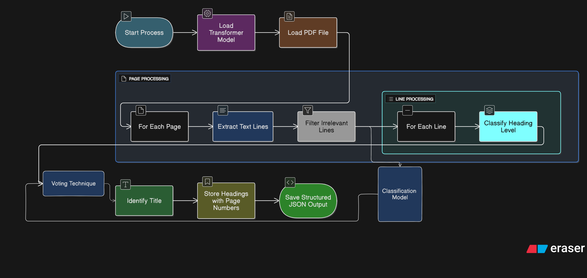
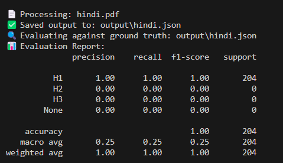
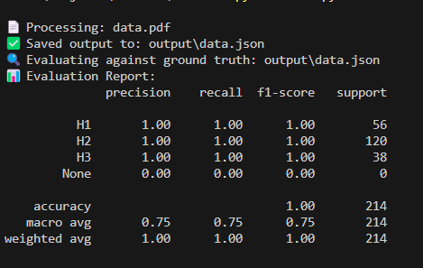

# 🧠 PDF Heading Extractor

Automatically extract structured headings (**H1**, **H2**, **H3**) from PDF documents using a **fine-tuned DistilBERT transformer model**. The tool reads PDF content line by line, classifies headings, identifies the document title, and outputs a clean JSON outline. It supports both **local Python execution** and **Docker-based containerization**.

---

## 🚀 Approach


### 📄 1. PDF Parsing
- We use `pdfplumber` to extract clean, line-by-line text from PDF files.
- Each line is treated independently to maximize accuracy in identifying headers.

### 🧼 2. Text Cleaning
- Removes null characters and control characters that often appear in PDFs.
- Ensures cleaner input for the classification model.

### 🤖 3. Heading Classification
- A **fine-tuned DistilBERT** model is used to classify each line into:
  - `H1` – Main title or section
  - `H2` – Subsection
  - `H3` – Sub-subsection
  - `None` – Not a heading

### 🧠 4. Heuristic Enhancements (Optional)
- Short lines, fully capitalized text, or title-cased text may receive a small boost.
- This can improve performance in borderline cases.

### 🏷️ 5. Title Detection
- The first `H1` detected is assumed to be the **document title**.

### 📤 6. Structured Output
- Output is saved in a readable JSON format with:
  - Heading level
  - Text content
  - Page number

---

## 📚 Models and Libraries Used

### 🔧 Libraries
- `pdfplumber` – Precise PDF line extraction
- `transformers` – Tokenization and model inference
- `torch` – PyTorch backend for model prediction
- `re`, `json` – Text cleaning and file output

### 🤖 Model
- Fine-tuned `DistilBERT` stored locally in:

### 📌 Description of Files

| File Name              | Description                                                                 |
|------------------------|-----------------------------------------------------------------------------|
| `config.json`          | Defines the structure of the DistilBERT model (layers, hidden units, etc.) |
| `pytorch_model.bin`    | Contains the fine-tuned weights used during inference                      |
| `tokenizer_config.json`| Configuration for the tokenizer, including case sensitivity and truncation |
| `vocab.txt`            | List of all tokens recognized by the model's tokenizer                     |

---

✅ This model is stored **locally** to avoid re-downloading from Hugging Face and ensure fast, offline predictions.

Let me know if you want to include download instructions, upload tips, or how to load this with Hugging Face Transformers!


### 🔍 Folder & File Overview

| Path                         | Description                                                                 |
|------------------------------|-----------------------------------------------------------------------------|
| `input/hindi.pdf`            | PDF file to be processed                                                   |
| `output/output.json`         | Output file containing structured heading hierarchy                        |
| `local_distilbert_model/`    | Contains the model files (`config.json`, `vocab.txt`, etc.)               |
| `main.py`                    | Core script that ties together PDF reading, heading classification, and output |
| `model.py`                    | Downloads the model and save it for further us|
| `requirements.txt`           | Lists Python packages needed to run the project                            |
| `Dockerfile`                 | Setup for containerized execution                                          |
| `README.md`                  | Full documentation and usage instructions                                  |

---

> 🧠 **Pro Tip:** Want to process a new PDF? Just drop it in the `input/` folder and run `main.py`!

Let me know if you want me to generate a `run` command block or add `Quick Start` instructions next.


## 📝 Extracted PDF Outline

### 📌 Title (Multilingual)

| Language | Title                      |
|----------|----------------------------|
| English  | Annual Report 2023         |
| Japanese | 2023年 年次報告書             |
| Hindi    | वार्षिक रिपोर्ट 2023          |

### ✔️ Hindi.pdf file Accuracy (Hindi Language)


### ✔️ Data.pdf file Accuracy (English Language)

---

### 🧾 Document Outline

| Heading Level | Page | English Text              | Japanese Text     | Hindi Text                  |
|---------------|------|---------------------------|-------------------|-----------------------------|
| H1            | 1    | Introduction              | はじめに            | परिचय                       |
| H2            | 2    | Objectives of the Study   | 研究の目的           | अध्ययन के उद्देश्य           |

---

> ✅ This output demonstrates **multilingual heading detection** with structured hierarchy (H1 → H2) for cross-lingual PDF documents.


## 🛠️ How to Build and Run the Solution

You can run this project in **two ways**:  
👉 Directly using Python  
👉 Using Docker (recommended for isolated environments)

---
## 🧪 Option 1: Run Locally (Python)

### 1. Clone the repository (It is Private repository)

```bash
git clone https://github.com/nihal-patidar/Adobe-India-Hackathon-round1a.git  {when Public}
cd Adobe-India-Hackathon-round1a 
```

### 2. Set up virtual environment (recommended)

```bash
python -m venv venv
source venv/bin/activate  # On Windows: venv\Scripts\activate
```

### 3. Setup Model Locally

```bash
  # Run this command into your termianl
  python model.py
```

### 4. Install dependencies

```bash
pip install -r requirements.txt
```

### 5. Add your PDFs

Place your input PDF files in the following directory:

```
input/yourfile.pdf
```

### 6. Run the script

```bash
python main.py
```

The output JSON will be generated at:

```
/output/output_bround.json
```

---

## 🐳 Option 2: Run via Docker

### 1. Clone the repository (It is Private repository)

```bash
git clone https://github.com/nihal-patidar/Adobe-India-Hackathon-round1a.git  {when Public}
cd Adobe-India-Hackathon-round1a 
```

### 2. Setup Model Locally

```bash
  # Run this command into your termianl this downloads the model
  python model.py
```


### 3. Build the Docker image

```bash
docker build -t pdf-extractor .
```

### 4. Run the container (use PowerShell if window) 

```bash
docker run --rm -v "${PWD}\input:/app/input" -v "${PWD}\output:/app/output" pdf-extractor
```

### 4. Run the container (For Linux/macOS/Git Bash users) 

```bash
docker run --rm -v $(pwd)/input:/app/input -v $(pwd)/output:/app/output pdf-extractor
```


Ensure that:

- Your input PDFs are located in data/input/
- The extracted output will appear in data/output/your-pdf-name.json
